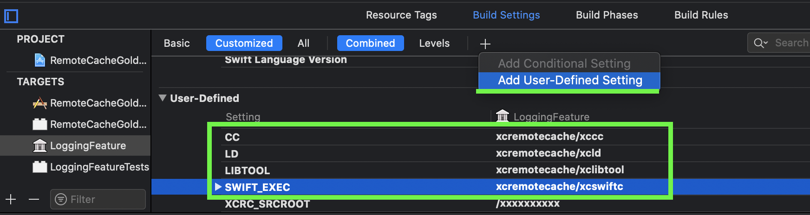
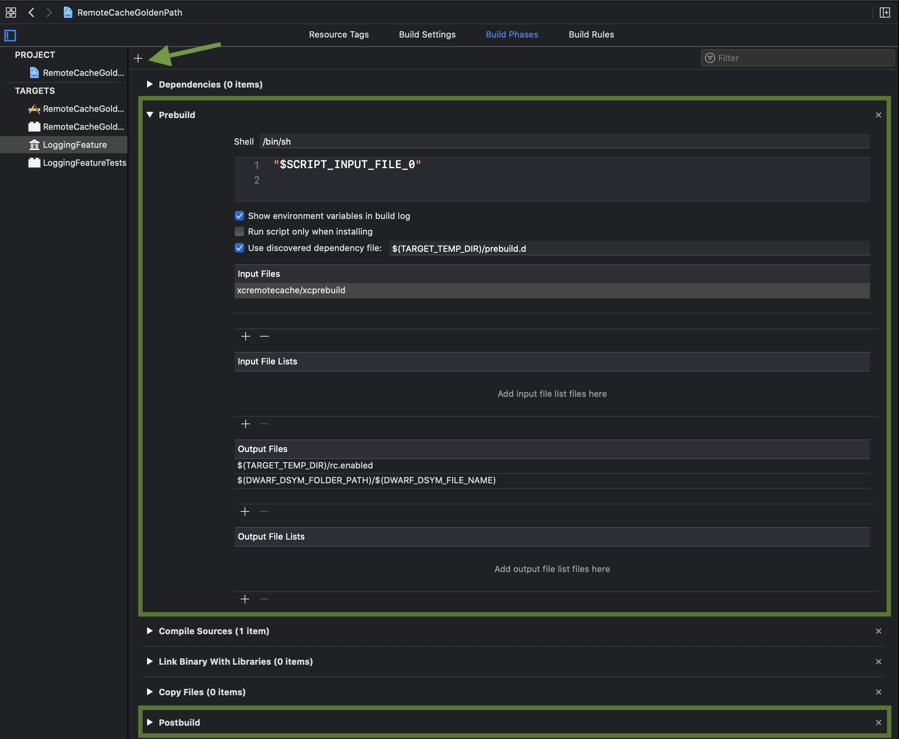

<p align="center">
    
</p>

_XCRemoteCache is a remote cache tool for Xcode projects. It reuses target artifacts generated on a remote machine, served from a simple REST server._

[](https://github.com/spotify/XCRemoteCache/workflows/CI/badge.svg)
[](LICENSE)
[](https://slackin.spotify.com)

- [How and Why?](#how-and-why)
  * [Accurate target input files](#accurate-target-input-files)
    + [New file added to the target](#new-file-added-to-the-target)
  * [Debug symbols](#debug-symbols)
  * [Performance optimizations](#performance-optimizations)
  * [Focused targets](#focused-targets)
- [How to integrate XCRemoteCache with your Xcode project?](#how-to-integrate-xcremotecache-with-your-xcode-project)
  * [1. Download XCRemoteCache](#1-download-xcremotecache)
  * [A. Automatic integration](#a-automatic-integration)
    + [2. Create a minimal XCRemoteCache configuration](#2-create-a-minimal-xcremotecache-configuration)
    + [3. Run automatic integration script](#3-run-automatic-integration-script)
      - [3a. Producer side](#3a-producer-side)
      - [3b. Consumer side](#3b-consumer-side)
        * [A full list of `xcprepare integrate` supported options](#a-full-list-of-xcprepare-integrate-supported-options)
  * [B. Manual integration](#b-manual-integration)
    + [2. Configure XCRemoteCache](#2-configure-xcremotecache)
    + [3. Call xcprepare](#3-call-xcprepare)
    + [4. Integrate with the Xcode project](#4-integrate-with-the-xcode-project)
    + [5. Configure LLDB source-map (Optional)](#5-configure-lldb-source-map-optional)
    + [6. Producer mode - Artifacts generation](#6-producer-mode---artifacts-generation)
      - [6a. Configure producer mode](#6a-configure-producer-mode)
      - [6b. Fill the cache](#6b-fill-the-cache)
      - [6c. Mark commit sha](#6c-mark-commit-sha)
- [A full list of configuration parameters:](#a-full-list-of-configuration-parameters)
- [Backend cache server](#backend-cache-server)
  * [Sample REST cache server from a docker image](#sample-rest-cache-server-from-a-docker-image)
  * [Amazon S3 and Google Cloud Storage](#amazon-s3-and-google-cloud-storage)
- [CocoaPods plugin](#cocoapods-plugin)
- [Requirements](#requirements)
- [Limitations](#limitations)
- [FAQ](#faq)
- [Development](#development)
- [Release](#release)
  * [Building release package](#building-release-package)
- [Contributing](#contributing)
- [Code of conduct](#code-of-conduct)
- [License](#license)
- [Security Issues?](#security-issues)

## How and Why?

The caching mechanism is based on remote artifacts that should be generated and uploaded to the cache server for each commit on a `master` branch, preferably as a part of CI/CD step. Xcode products are not portable between different Xcode versions, each XCRemoteCache artifact is linked with a specific Xcode build number that generated it. To support multiple Xcode versions, artifacts generation should happen for each Xcode version.

The artifact reuse flow is as follows: XCRemoteCache performs a target precheck (aka prebuild) and if a fingerprint for local sources matches the one computed on a generation side, several compilation steps wrappers (e.g. `xcswiftc`, `xccc`, `xclibtool`) mock corresponding compilation step(s) and linking (or archiving) moves the cached build artifact to the expected location.

> Multiple commits that have the same target sources reuse artifact package on a remote server.

### Accurate target input files 

Finding a precise list of input and dependency files is a non-trivial task as Xcode heavily relies on implicit target dependencies. It means that Xcode is trying to use required dependencies from provided search paths and looks up `DerivedData`'s product dir. To find a narrow list of files to compute fingerprint hash, XCRemoteCache fetches a `meta.json` file from a server which contains remotelly generated fingerprint hash and a list of input files that should constitute a fingerprint. That list of input files was produced during the artifact generation process, based on `.d` output from `clang` and `swift` compilers. 

Before building a project in Xcode, XCRemoteCache needs to find the best git commit sha for which artifacts will be used. This happens as a part of the `xcprepare` execution, which should be called after each merge or switching a branch. `xcprepare` finds a list of 10 most recent common sha with the remote repo branch using git's first-parent strategy and selects the newest one for which all artifacts have been uploaded. 

_The generation side is responsible to call `xcprepare mark` subcommand after each successful build. Marking process creates an empty marker file on a remote cache server with a given format: `#{commmmitSha}-#{TargetName}-#{Configuration}-#{Platform}-#{XcodeBuildNumber}-#{ContextBuildSettings}-#{SchemaID}.json`._

`xcprepare` makes `HEAD` requests for all identified shas, picks the newest one for which a marker file exists remotely, and saves it in the text form to the `arc.rc` file. That file informs the prebuild phase which meta file should be fetched to get a list of target dependency files.

#### New file added to the target

Considering in the hash fingerprint only a list of previously observed files can give invalid results if a build contains a new source file as it isn't considered in the hash. 

For a new `.swift` file in a swift-only target, `xcswiftc` automatically recognizes that case and forces local compilation of the entire target. For Objective-C or mixed targets, fallbacking to the local compilation is more difficult as some previous invocations (either `xccc` or `xcswiftc`) could already be finished with no-operation. To mitigate that, each wrapper appends invocation call to a side file (`history.compile`) just in case some other process would need to compile the entire target locally. If that happens, compilation of the newly added file acquires a target-wide lock that stops other wrapper invocations, executes already mocked steps one by one to backfill already skipped compilation steps.

### Debug symbols

Binaries built with "debug symbols: enabled" embed source file absolute paths so compilation products cannot be directly ported between two machines with different source roots. Otherwise, LLDB debugger is not able to correlate a set of currently executing machine instructions with a local file that produced it. To mitigate that,  XCRemoteCache recommends adding a custom C and Swift debug flags `prefix-map` for all XCRemoteCache builds. These flags ensure that all binaries, generated locally and downloaded from a remote server, have the same debug symbols absolute paths which are translated to an actual local path at the beginning of the LLDB session.

### Performance optimizations

XCRemoteCache involves several optimization techniques:

* Local HTTP cache stores all responses from the remote server at `~/Library/Caches/XCRemoteCache/`
* Prebuild and postbuild steps leverage Xcode's discovered dependency file to avoid recomputing fingerprint hashes if none of the input files has changed
* A wrapper for the `clang` compilation is a C program, generated and compiled during the `xcprepare` step. It is called many times to compile each `*.(m|c)` file and accessing a disk to read a configuration would introduce a significant slowdown, especially if a project contains a lot of Objective-C files. As a remedy, `xcprepare` reads the XCRemoteCache configuration only once and embeds all configurable fields directly into the `xccc` binary
* `arc.rc`, generated by `xcprepare`, gets file modification equal to the commit date if refers. `arc.rc` is included in the discovered dependency file, touching it in the `xcprepare` would automatically invalidate previous XCRemoteCache prebuild step and force redundant fingerprint checks. By syncing the `mdate` with a git commit, Xcode avoids prebuild steps unless the remote cache commit has changed
* If a target cache miss happens, XCRemoteCache disables cache for that target until a commit sha in `arc.rc` changes. That bypasses a fingerprint computation for incremental builds

### Focused targets

If a list of targets that can have dirty sources is limited, XCRemoteCache can be configured with focused targets, specified in `.rcinfo`.

By default, all targets are focused and these compare local fingerprint with one available remotely and fallbacks to the local compilation if it doesn't match. Non-focused targets, called 'thin' targets, always use cached artifacts what eliminates a fingerprint computation. Thin targets should contain only a single compilation file with `thin_target_mock_filename`, e.g. `standin.swift` or `standin.m`.

## How to integrate XCRemoteCache with your Xcode project?

To enable XCRemoteCache in the existing `.xcodeproj` you need to  add extra build settings and build phases to targets that you want to cache. 

You can do that in an automatic way, using the XCRemoteCache-provided integration command, or manually modify your Xcode project.   

### 1. Download XCRemoteCache

From the Github [Releases page](https://github.com/spotify/XCRemoteCache/releases), download the XCRemoteCache bundle zip. Unzip the bundle to a directory next to your `.xcodeproj`. 

_The following steps will assume the bundle has been unzipped to `xcremotecache` dir, placed next to the `.xcodeproj`._

### A. Automatic integration

#### 2. Create a minimal XCRemoteCache configuration

Create `.rcinfo` yaml file next to the `.xcodeproj` with a minimum set of configuration entries, like: 
```yaml
primary_repo: https://yourRepo.git
cache_addresses:
- https://xcremotecacheserver.com
```

#### 3. Run automatic integration script

##### 3a. Producer side

Execute a command that modifies `<yourProject.xcodeproj>`:
```bash
xcremotecache/xcprepare integrate --input <yourProject.xcodeproj> --mode producer --final-producer-target <YourMainTarget>
```

##### 3b. Consumer side

Execute a command that modifies `<yourProject.xcodeproj>`:
```bash
xcremotecache/xcprepare integrate --input <yourProject.xcodeproj> --mode consumer
```

###### A full list of `xcprepare integrate` supported options

| Argument | Description | Default | Required |
| ------------- | ------------- | ------------- | ------------- |
| `--input` | .xcodeproj location  | N/A | ✅ |
| `--mode` | mode. Supported values: `consumer`, `producer`, `producer-fast`(experimental) | N/A | ✅ |
| `--targets-include` | comma-separated list of targets to integrate XCRemoteCache. | `""` | ⬜️ |
| `--targets-exclude` | comma-separated list of targets to not integrate XCRemoteCache. Takes priority over --targets-include.  | `""` | ⬜️ |
| `--configurations-include` | comma-separated list of configurations to integrate XCRemoteCache.  | `""` | ⬜️ |
| `--configurations-exclude` | comma-separated list of configurations to not integrate XCRemoteCache. Takes priority over --configurations-include. | `Release` | ⬜️ |
| `--final-producer-target` | [Producer only] The final target that generates cache artifacts. Once this targets is finished, no other targets are allowed to upload artifacts to the remote server for a given sha, configuration and platform context.  | `nil` | ⬜️ |
| `--consumer-eligible-configurations` | [Consumer only] comma-separated list of configurations that need to have all artifacts uploaded to the remote site before using given sha. | `Debug` | ⬜️ |
| `--consumer-eligible-platforms` | [Consumer only] comma-separated list of platforms that need to have all artifacts uploaded to the remote site before using given sha | `iphonesimulator` | ⬜️ |
| `--lldb-init` | LLDBInit mode. Appends to .lldbinit a command required for debugging. Supported values: 'none' (do not append to .lldbinit), 'user' (append to ~/.lldbinit) | `user` | ⬜️ |
| `--fake-src-root` | An arbitrary source location shared between producers and consumers. Should be unique for a project. | `/xxxxxxxxxx` | ⬜️ |
| `--output` | Save the project with integrated XCRemoteCache to a separate location.  | N/A | ⬜️ |

</details>


### B. Manual integration

#### 2. Configure XCRemoteCache

Create yaml configuration file `.rcinfo`, next to the `.xcodeproj`, with your full XCRemoteCache configuration, according to [the parameters list](#a-full-list-of-configuration-parameters) e.g.: 

```yaml
primary_repo: https://yourRepo.git
cache_addresses:
 - https://xcremotecacheserver.com
repo_root: "."
remote_commit_file: arc.rc
xccc_file: xcremotecache/xccc
```

#### 3. Call xcprepare

Execute `xcprepare --configuration #Configuration# --platform #platform#` command after each merge or rebase with the primary branch. Otherwise, the remote cache artifacts may be outdated and final hit rate may be poor.

The `xcprepare` application saves `arc.rc` file on a disk and prints a summary to the standard output. The printed `recommended_remote_address` is just a recommendation which cache remote server use. It is up to the integration tooling to decide if it makes sense. If so, the project's `.rcinfo` should define that value as `recommended_remote_address` parameter.

Example:

```shell
$ xcremotecache/xcprepare --configuration Debug --platform iphonesimulator
result: true
commit: aabbccc00
age: 0
recommended_remote_address: https://xcremotecacheserver.com
``` 

#### 4. Integrate with the Xcode project

Configure Xcode targets that **should use** XCRemoteCache: 

1. Override Build Settings:
* `CC` - `xccc_file` from your `.rcinfo` configuration (e.g. `xcremotecache/xccc`)
* `SWIFT_EXEC` - location of `xcprepare` (e.g. `xcremotecache/xcswiftc`)
* `LIBTOOL` - location of `xclibtool` (e.g. `xcremotecache/xclibtool`)
* `LD` - location of `xcld` (e.g. `xcremotecache/xcld`)

<details>
  <summary>Screenshot</summary>



</details>

2. Add a `Prebuild` build phase (before compilation):
* command: `"$SCRIPT_INPUT_FILE_0"`
* input files: location of `xcprebuild` (e.g. `xcremotecache/xcprebuild`)
* output files: 
  * `$(TARGET_TEMP_DIR)/rc.enabled`
  * `$(DWARF_DSYM_FOLDER_PATH)/$(DWARF_DSYM_FILE_NAME)`
* discovery dependency file: `$(TARGET_TEMP_DIR)/prebuild.d`
3. Add `Postbuild` build phase (after compilation):
* command: `"$SCRIPT_INPUT_FILE_0"`
* input files: location of `xcpostbuild` command (e.g. `xcremotecache/xcpostbuild`)
* output files: 
  * `$(TARGET_BUILD_DIR)/$(MODULES_FOLDER_PATH)/$(PRODUCT_MODULE_NAME).swiftmodule/$(PLATFORM_PREFERRED_ARCH).swiftmodule.md5`
  * `$(TARGET_BUILD_DIR)/$(MODULES_FOLDER_PATH)/$(PRODUCT_MODULE_NAME).swiftmodule/$(PLATFORM_PREFERRED_ARCH)-$(LLVM_TARGET_TRIPLE_VENDOR)-$(SWIFT_PLATFORM_TARGET_PREFIX)$(LLVM_TARGET_TRIPLE_SUFFIX).swiftmodule.md5`
* discovery dependency file: `$(TARGET_TEMP_DIR)/postbuild.d`

<details>
  <summary>Screenshot</summary>



</details>

#### 5. Configure LLDB source-map (Optional)

Rewriting source-map is required to support debugging and hit breakpoints, see [Debug symbols](#debug-symbols). 

1. Ooverride the following Build Settings for **all targets**:
* `XCRC_SRCROOT` - `/xxxxxxxxxx` (or any other arbitrary string for your project)
* add `-debug-prefix-map $(SRCROOT)=$(XCRC_SRCROOT)` to `OTHER_SWIFT_FLAGS`. _If it doesn't exist, define it as `$(inherited) -debug-prefix-map $(SRCROOT)=$(XCRC_SRCROOT)`_
* add `-fdebug-prefix-map=$(SRCROOT)=$(XCRC_SRCROOT)` to `OTHER_CFLAGS`. _If it doesn't exists, define it as `$(inherited) -fdebug-prefix-map=$(SRCROOT)=$(XCRC_SRCROOT)`_
2. Add `settings set target.source-map /xxxxxxxxxx /Users/account/src/PathToTheProject` to `~/.lldbinit` on end machine that builds a project with XCRemoteCache 

> `XCRC_SRCROOT` arbitrary path should be project-exclusive to avoid clashing.

_Tip: In some rare cases, Xcode caches `~/.lldbinit` content so make sure to restart Xcode after the modification._

#### 6. Producer mode - Artifacts generation

XCRemoteCache can operate in two main modes: `consumer` (default) tries to reuse artifacts available on the remote server and `producer` is used to generate all artifacts - it builds all targets locally and uploads meta and artifact files to the remote cache server. 

##### 6a. Configure producer mode

To enable the `producer` mode, configure it directly in the `.rcinfo` file. 

> Optionally, you can define `extra_configuration_file` in a `.rcinfo` with a path to the other yaml file that will override the default configuration in `.rcinfo`. That approach can be useful if you want to track main `.rcinfo` and keep your local configuration out of git.

##### 6b. Fill the cache

Build the project from Xcode or using `xcodebuild`

##### 6c. Mark commit sha

Once all artifacts have been uploaded, "mark a build" using `xcprepare mark` command:

```shell
$ xcremotecache/xcprepare mark --configuration Debug --platform iphonesimulator
```

That command creates an empty file on a remote server which informs that for given sha, configuration, platform, Xcode versions etc. all artifacts are available.

_Note that for the `producer` mode, the prebuild build phase and `xccc`, `xcld`, `xclibtool` wrappers become no-op, so it is recommended to not add them for the `producer` mode._

## A full list of configuration parameters:

| Property | Description | Default | Required |
| ------------- | ------------- | ------------- | ------------- |
| `mode` | build mode. Possible values: `consumer`, `producer` | `consumer` | ⬜️ |
| `cache_addresses` | Addresses of all remote cache replicas. _Required to be a non-empty array of strings_ | N/A | ✅ |
| `recommended_cache_address` | Address of the best remote cache to use in the consumer mode. If not specified, the first item in `cache_addresses` will be used | N/A | ⬜️ |
| `cache_health_path` | Probe request path to the `cache_addresses` (relative to a path in `cache_addresses`) that determines the best cache to use | `nginx-health` | ⬜️ |
| `cache_health_path_probe_count` | Number of `cacheAddresses` probe requests | `3` | ⬜️ |
| `remote_commit_file` | Filepath to the file with the remote commit sha | `build/remote-cache/arc.rc` | ⬜️ |
| `xccc_file` | Path to the xccc wrapper | `build/bin/xccc` | ⬜️ |
| `prebuild_discovery_path` | Path, relative to `$TARGET_TEMP_DIR`, that specifies prebuild discovery .d file | `prebuild.d` | ⬜️ |
| `postbuild_discovery_path` | Path, relative to `$TARGET_TEMP_DIR`, that specifies postbuild discovery .d file | `postbuild.d` | ⬜️ |
| `mode_marker_path` | Path, relative to `$TARGET_TEMP_DIR`, of a maker file to enable or disable the remote cache for a given target. Includes a list of all allowed input files to use remote cache | `rc.enabled` | ⬜️ |
| `clang_command` | Command for a standard C compilation fallback | `clang` | ⬜️ |
| `swiftc_command` | Command for a standard Swift compilation fallback | `swiftc` | ⬜️ |
| `primary_repo` | Address of the primary git repository that produces cache artifacts (case-sensitive) | N/A | ✅ |
| `primary_branch` | The main (primary) branch on the `primary_repo` that produces cache artifacts | `master` | ⬜️ |
| `repo_root` | The path to the git repo root | `"."` | ⬜️ |
| `cache_commit_history` | Number of historical git commits to look for cache artifacts | `10` | ⬜️ |
| `source_root` | Source root of the Xcode project | `""` | ⬜️ |
| `fingerprint_override_extension` | Fingerprint override extension (sample override `Module.swiftmodule/x86_64.swiftmodule.md5`) | `md5` | ⬜️ |
| `extra_configuration_file` | Configuration file that overrides project configuration | `user.rcinfo` | ⬜️ |
| `publishing_sha` | Custom commit sha to publish artifact (producer only) | `nil` | ⬜️ |
| `artifact_maximum_age` | Maximum age in days HTTP response should be locally cached before being evicted | `30` | ⬜️ |
| `custom_fingerprint_envs` | Extra ENV keys that should be convoluted into the environment fingerprint | `[]` | ⬜️ |
| `stats_dir` | Directory where all XCRemoteCache statistics (e.g. counters) are stored | `~/.xccache` | ⬜️ |
| `download_retries` | Number of retries for download requests | `0` | ⬜️ |
| `upload_retries` | Number of retries for upload requests | `3` | ⬜️ |
| `request_custom_headers` | Dictionary of extra HTTP headers for all remote server requests | `[]` | ⬜️ |
| `thin_target_mock_filename` | Filename (without an extension) of the compilation input file that is used as a fake compilation for the forced-cached target (aka thin target) | `standin` | ⬜️ |
| `focused_targets` | A list of all targets that are not thinned. If empty, all targets are meant to be non-thin | `[]` | ⬜️ |
| `disable_http_cache ` | Disable cache for http requests to fetch metadata and download artifacts | `false` | ⬜️ |
| `compilation_history_file ` | Path, relative to $TARGET_TEMP_DIR which gathers all compilation commands that should be executed if a target switches to local compilation. Example: A new `.swift` file invalidates remote artifact and triggers local compilation. When that happens, all previously skipped clang build steps need to be eventually called locally - this file lists all these commands. | `history.compile` | ⬜️ |
| `timeout_response_data_chunks_interval ` | Timeout for remote response data interval (in seconds). If an interval between data chunks is longer than a timeout, a request fails. | `20` | ⬜️ |
| `turn_off_remote_cache_on_first_timeout ` | If true, any observed request timeout switches off remote cache for all targets | `false` | ⬜️ |
| `product_files_extensions_with_content_override ` | List of all extensions that should carry over source fingerprints. Extensions of all product files that contain non-deterministic content (absolute paths, timestamp, etc) should be included. | `["swiftmodule"]` | ⬜️ |
| `thinning_enabled ` | If true, support for thin projects is enabled | `false` | ⬜️ |
| `thinning_target_module_name ` | Module name of a target that works as a helper for thinned targets | `"ThinningRemoteCacheModule"` | ⬜️ |
| `aws_secret_key` | Secret key for AWS V4 Signature Authorization. If this is set to a non-empty String - an Authentication Header will be added based on this and the other `aws_*` parameters.| `""` | ⬜️ |
| `aws_access_key` | Access key for AWS V4 Signature Authorization. | `""` | ⬜️ |
| `aws_region` | Region for AWS V4 Signature Authorization. E.g. `eu`.  | `""` | ⬜️ |
| `aws_service` | Service for AWS V4 Signature Authorization. E.g. `storage`. | `""` | ⬜️ |


## Backend cache server

As a cache server, XCRemoteCache may use any REST server that supports PUT, GET and HEAD methods. 

For the development phase, you can try the simplest cache server available as a docker image in [backend-example](backend-example). For the production environment, it is recommended to configure a reliable, fast server, preferrably located in a close proximity to developer's machines.

Out-of-the-box, XCRemoteCache supports V4 Signature Authorization used by Amazon's S3 and Google's GCS. Altenatively, if your server has a customized authentication procedure, you can add extra HTTP request headers with `request_custom_headers` configuration property.

### Sample REST cache server from a docker image

To run a local instance of a server, use a snippet which exposes a cache endpoint under `http://localhost:8080/cache`:

```bash
docker build -t xcremotecache-demo-server backend-example
docker run -it --rm -d -p 8080:8080 --name xcremotecache xcremotecache-demo-server
```

As the docker image saves all files in a container non-persistent storage, to reset cache's content, just restart it:
```bash
# stop the container
docker kill xcremotecache
# run a new instance of the image
docker run -it --rm -d -p 8080:8080 --name xcremotecache xcremotecache-demo-server
```

To review all files stored in the cache server, navigate to the container's cache root directory:
```bash
docker exec -w /tmp/cache -it xcremotecache /bin/bash
```

### Amazon S3 and Google Cloud Storage

XCRemoteCache supports Amazon S3 and Google Cloud Storage buckets to be used as cache servers using the Amazon v4 Signature Authorization.

To set it up use the configuration parameters `aws_secret_key`, `aws_access_key`, `aws_region`, and `aws_service` in the `.rcinfo` file. Specify the URL to the bucket in cache-addresses field in the same file.

Example
```yaml
...
cache_addresses:
 - https://bucketname.s3.eu-central-1.amazonaws.com/
aws_secret_key: <SECRET_KEY>
aws_access_key: <ACCESS_KEY>
aws_region: eu-central-1
aws_service: s3
...
```

Retention Policy: Buckets usually have a retention policy option which ensures objects are retained for a certain amount of time and won't be modified or deleted. Keep this option short or disable it to avoid errors in case multiple builds are done consecutively on the producer side for the same configuration.

## CocoaPods plugin

Head over to our [cocoapods-plugin](cocoapods-plugin/README.md) docs to see how to integrate XCRemoteCache in your CocoaPods project.

## Requirements

* The repo under `git` version control
* Xcode 11.4+
* Xcode New Build System
* Current Xcode location set by `xcode-select`
* Using the default Xcode Toolchain
* Recommended: multi-targets Xcode project
* Recommended: do not use fast-forward PR strategy (use merge or squash instead)
* Recommended: avoid `DWARF with dSYM File` "Debug Information Format" build setting. Use `DWARF` instead

## Limitations

* Swift Package Manager (SPM) dependencies are not supported. _Because SPM does not allow customizing Build Settings, XCRemoteCache cannot specify `clang` and `swiftc` wrappers that control if the local compilation should be skipped (cache hit) or not (cache miss)_
* Filenames with `_vers.c` suffix are reserved and cannot be used as a source file
* All compilation files should be referenced via the git repo root. Referencing `/AbsolutePath/someOther.swift` or `../../someOther.swift` that resolve to the location outside of the git repo root is prohibited.

## FAQ

Follow the [FAQ](docs/FAQ.md) page.

## Development

Follow the [Development](docs/Development.md) guide. It has all the information on how to get started.

## Release 

To release a version, in [Releases](https://github.com/spotify/XCRemoteCache/releases) draft a new release with `v0.3.0{-rc0}` tag format. 
Packages with binaries will be automatically uploaded to the GitHub [Releases](https://github.com/spotify/XCRemoteCache/releases) page.

### Building release package

To build a release zip package for a single platform (e.g. `x86_64-apple-macosx`, `arm64-apple-macosx`), call:

```shell
rake 'build[release, x86_64-apple-macosx]'
```

The zip package will be generated at `releases/XCRemoteCache.zip`.

## Support

Create a [new issue](https://github.com/spotify/XCRemoteCache/issues/new) with as many details as possible.

Reach us at the `#xcremotecache` channel in [Slack](https://slackin.spotify.com/).

## Contributing

We feel that a welcoming community is important and we ask that you follow Spotify's 
[Open Source Code of Conduct](https://github.com/spotify/code-of-conduct/blob/master/code-of-conduct.md)
in all interactions with the community.

## Code of conduct

This project adheres to the [Open Code of Conduct](https://github.com/spotify/code-of-conduct/blob/master/code-of-conduct.md). By participating, you are expected to honor this code.

## License

```
Copyright 2021 Spotify AB

Licensed under the Apache License, Version 2.0 (the "License");
you may not use this file except in compliance with the License.
You may obtain a copy of the License at

    http://www.apache.org/licenses/LICENSE-2.0

Unless required by applicable law or agreed to in writing, software
distributed under the License is distributed on an "AS IS" BASIS,
WITHOUT WARRANTIES OR CONDITIONS OF ANY KIND, either express or implied.
See the License for the specific language governing permissions and
limitations under the License.
```

## Security Issues?

Please report sensitive security issues via Spotify's bug-bounty program (https://hackerone.com/spotify) rather than GitHub.
