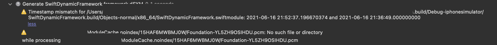
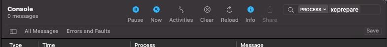

## FAQ

### How debug symbols are reused between machines with different absolute paths?

When a compiler builds for debugging it includes an absolute path of a sourcefile to the artifact products. That allows an IDE to show a code block that generated a given frame instead of a raw machine instruction. When compilation steps happened on multiple machines with different sourcecode absolute paths, the debugger will not be able to provide a nice debugging experience like stacktrace. 
To align debug symbols, XCRemoteCache assumes that compilation steps produce symbols with a common absolute path to the source root. To introduce virtual source root paths in the debug symbols map Clang and Swift compilers invocations should include `-fdebug-prefix-map` or `-debug-prefix-map`, respectively.
In the runtime, all debug symbols have the same source root, that virtual absolute path has to be remapped to the actual machine absolute path - XCRemoteCache uses LLDB's `target.source-map` setting for that. Note: `target.source-map` setting has to be defined before loading a library, so it is recommended to place it as a part of the lldb initialization process (e.g. in the `~/.lldbinit` file).
To read more, visit corresponding documents: [clang](https://reviews.llvm.org/rG436256a71316a1e6ad68ebee8439c88d75f974e9), [swift](https://github.com/apple/swift/pull/17665), [LLDB](https://lldb.llvm.org/use/map.html#miscellaneous).

Note: Note that Swift's `#filePath` will contain a virtual absolute path. For a better experience, use `#file` instead (see [SE-0274](https://github.com/apple/swift-evolution/blob/master/proposals/0274-magic-file.md)).

### When building a dynamic framework, "Generated xxxxxx.framework.dSYM" step produces a warning with "timestamp mismatch" and "missing pcm files".

<details>
  <summary>Screenshot</summary>



</details>

This warning occurs if your build settings enable `DWARF with dSYM File` Debug Information Format (`DEBUG_INFORMATION_FORMAT`). To get rid of it, change its value to `DWARF`.
For dynamic libraries, XCRemoteCache always generates dSYM file (even when `DEBUG_INFORMATION_FORMAT=DWARF`) to correctly handle debug symbols generated across many machines. When `DWARF with dSYM File` is enabled, Xcode's validation fails as some paths (that use the virtual path) do not exist locally.

<details>
  <summary>Screenshot</summary>


</details>

### How can I find XCRemoteCache logs?

<details>
  <summary>Option 1: Console.app</summary>

Open the Console.app, start capturing logs and filter for the proces (e.g. `xcprepare`, `xcprebuild`, `xcswiftc` etc.)



</details>

<details>
  <summary>Option 2: Terminal</summary>

```shell
# Logs from the xcprepare (last 1 min)
log show --predicate 'sender == "xcprepare"' --style compact --info --debug -last 1m

# Logs from the all XCRemoteCache commands (last 10 mins)
log show --predicate 'sender BEGINSWITH "xc"' --style compact --info --debug -last 10m
```
</details>

### Troubleshooting cache misses

Here is a non-exhaustive list of steps that may help with troubleshooting poor cache hit rate.

1. ***Producer&Consumer:*** Review XCRemoteCache [Requirements](../#Requirements) and [Limitations](../#limitations)
1. ***Producer&Consumer:*** Make sure a producer build uses the same architecture(s) as a consumer. You can inspect `ARCHS` Build Setting in Xcode's Script Phase output logs. Navigate to the report navigator (⌘+9) and expand XCRemoteCache's `prebuild` step output using the "collapsed menu icon" (aka hamburger menu)
1. ***Producer:*** Verify that all Xcode targets have a Build Phase called `postbuild`
1. ***Producer:*** If you are using optional XCRemoteCache auto-marking feature (`--final-producer-target` or `final_target`) verify an extra Build Phase called `mark` is added to the specified target
1. ***Producer:*** After a full build, review logs according to [docs](#how-can-i-find-xcremotecache-logs)
1. ***Consumer:*** Verify that all Xcode targets have extra XCRemoteCache Build Phase called `prebuild` and `postbuild`
1. ***Consumer:*** After a full build, review according to [docs](#how-can-i-find-xcremotecache-logs). Find a ***first:*** target that reports a cache miss with a message like `Prebuild step failed with error: ...`. If a target reports faces a cache miss, it may have a knock-on effect where a lot of its consumers (dependant targets) need to be built locally too
1. ***Consumer:*** ***After a full build, review all meta files placed in `~/Library/Caches/XCRemoteCache/{your_host_path}/meta/*.json` and make sure no absolute paths are used in its `dependencies`. All paths should start a placeholder, like `$(SRCROOT)` or `$(BUILD_DIR)`***
1. ***Consumer:*** If you are integrating XCRemoteCache and rebuild artifacts for the same sha, previously downloaded artifacts placed in a local cache may still be used on a consumer side. You can either manually delete your local cache at `~/Library/Caches/XCRemoteCache/` before any consumer build or disable a local cache with `artifact_maximum_age: 0` property in `.rcinfo`
1. ***Consumer:*** To find an actual cache hit, before building in Xcode reset statistics with `xcprepare stats --reset` and once it is done, call `xcprepare stats` to find a cache hit rate
