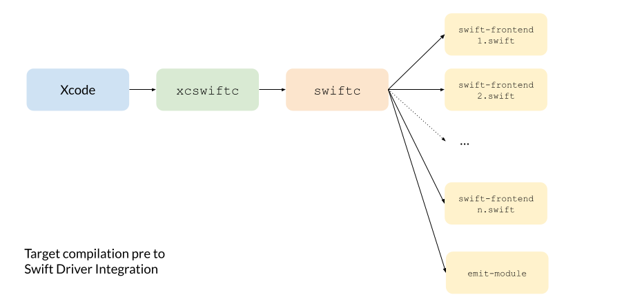
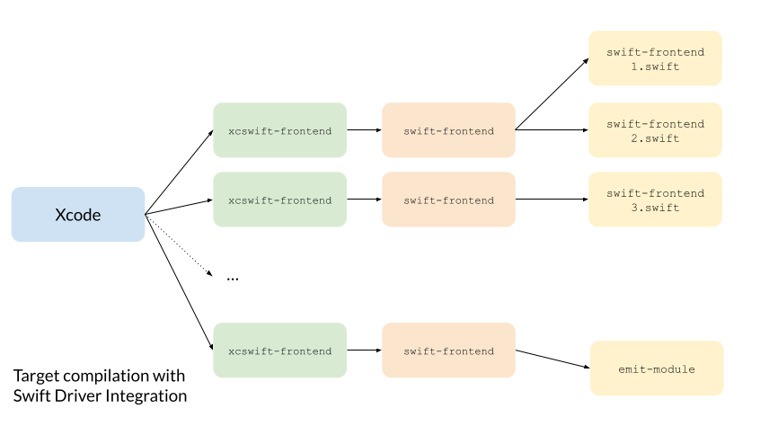
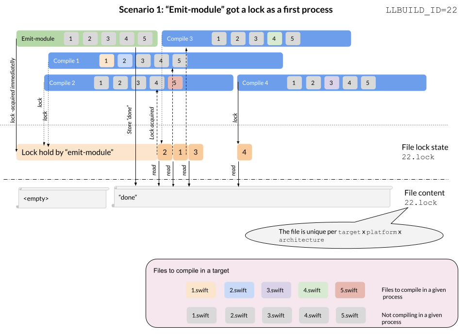
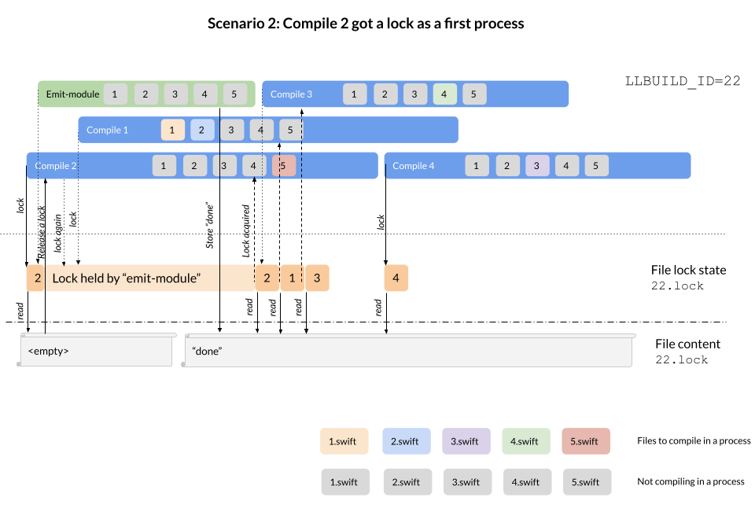

## Swift Driver Integration

### Pre Swift Driver Integraiton 

Historically (prior to Xcode 14), Swift compilation step was invoked by Xcode as a single external process. Xcode was calling `swiftc` and passed all required parameters (like all input files, output destinations, header paths etc.), and read its standard output to recognize the status of a compilation. Esentially, there were two build systems: "the big one" from Xcode and "small one" by Swift.

That design was easy to mock using XCRemoteCache, where the `xcswiftc` wrapper was first inspecting if the cached artifact can be reused (e.g. no new input `.swift` files were added to the list of compilation files) and based on that either continued with the local compilation or mocking the compilation and existing early (cache hit).

### Swift Driver Integration Design

With the upgraded design, Xcode splits the work into `n` subprocesses (when `n` is ~CPU), each responsible to compile a subset of files/actions. To mitigate that, XCRemoteCache sets a single place to identify if the cached artifact is applicable - in a `swift-frontend` process responsible for module emitting. It has been found that this process is scheduled very early int the workflow timeline (with some aproximation, we could say it is scheduled as a first step) so it seems as best candidate for the "pre-work". 

As the same executable is invoked multiple times for the same target (emit module, and multiple batches of compilation), XCRemoteCaches uses a file lock-based synchronization. Each `xcswift-frontend` (the wrapper for `swift-frontend`) tries to acquire a target-unique lock file (the file has a name equal to the `LLBUILD_BUILD_ID` ENV, which is unique for each build, and the file is placed in the `Intermediate` directory) and reads its content to find if the "pre-work" from the emit-module has been already done or not. As a lock file is unique per target and a build (it is actually unique per target compilation, as placed in `TARGET_TEMP_DIR`), initially the file is empty. If any of a non emit module invocation sees a file is empty (note that before reading, it acquires a shared lock), the lock is immediatelly released to quickly let the actual emit-module wrapper do the "pre-work". Emit module step holds a shared lock for the time of the entire process lifetime, so only once the "pre-work" is finished, all other `xcswift-frontend` processes can continue their job (wither noop or fallbacking to the `swift-frontent` in case a cache miss). Non emit-module steps (often, but not exclusive, compilation steps) acquire a lock only for a very short perdio - to read the content of that file so they could run in parallel.s

### Sample timelines

#### Emit Module acquires a lock first (common) 

#### A compilation step acquires a lock first (uncommon but possible) 

### Other considerations/open questions

* For mixed targets (ObjC&Swift), Xcode triggers `.m` compilation steps after the module emitting to ensure that the `-Swift.h` is available. That means, the synchronization algorithm will also postpone any `clang` invocations until the Swift "pre-work" is done - so mixed targets should behave the same way as in the non Swift Driver Integration flow
* For the WMO mode (Whole Module Optimization), all compilation steps are combined into a single `swift-frontend` process. As the emit module step is still invoked first, the WMO flow build builds down to a special case of the non-WMO. Therefore, the same algoritm should work for WMO builds too.
