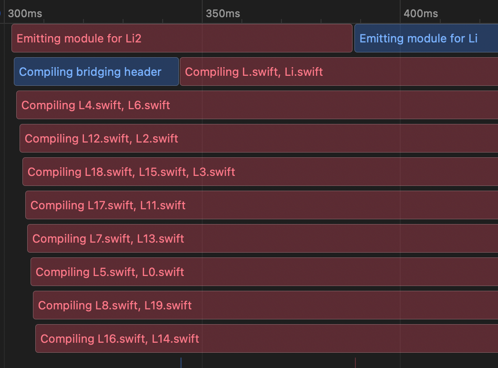

## Swift Driver Integration

### Pre Swift Driver Integration

Historically (prior to Xcode 14), Swift compilation step was invoked by Xcode as a single external process. Xcode was calling `swiftc` and passing all required parameters (like all input files, output destinations, header paths etc.), and reading its standard output to recognize the status/state of a compilation. Essentially, there were two build systems: "the big one" from Xcode and "small one" by Swift.

That design was easy to mock in the XCRemoteCache, where the `xcswiftc` wrapper was first inspecting if the cached artifact can be reused (e.g. no new input `.swift` files were added to the list of compilation files) and based on that either continuing with the local compilation (cache miss) or mocking the compilation and existing early (cache hit).

    
    

### Swift Driver Integration Design

With the upgraded design (aka Swift Driver Integration), Xcode splits the work into `n` subprocesses (when `n` is ~CPU), each responsible to compile a subset of files/actions. To align with that, XCRemoteCache meeds to specify a single place to identify if the cached artifact is applicable. `swift-frontend` has been picked for that - process responsible for module emitting. By reviewing Xcode's behavior, it has been found that this process is scheduled very early in the workflow timeline (with some approximation, we could say it is scheduled as a first step) so it seems as best candidate for the "pre-work".

As the same executable `swift-frontend` is invoked multiple times for the same target (e.g. to emit module, multiple batches of compilation etc.), XCRemoteCaches uses a file lock-based synchronization. Each `xcswift-frontend` (the wrapper for `swift-frontend`) tries to acquire a unique lock file. The lock has a name `$LLBUILD_BUILD_ID.lock`, which is unique for each build, placed in the `Intermediate` directory. `xcswift-frontend` process reads its content to find if the "pre-work" from the emit-module has already been done - if not, it releases a lock a gives a way to other processes (presumably the "emit-module") to do the required work. As a lock file is unique per target and a build (it is actually unique per target compilation, placed in `TARGET_TEMP_DIR`), initially the file is empty.

Note the emit module step holds a shared lock for the time of the entire process lifetime, so only once the "pre-work" is finished, all other `xcswift-frontend` processes can continue their job (with either noop or fallbacking to the `swift-frontend` in case a cache miss). Non emit-module steps (compilation steps) acquire a lock only for a very short period - to read the content of that file, thus multiple batches of compilation can run in parallel.

    
    

### Sample timelines

#### Emit Module acquires a lock first (common)

    
    

#### A compilation step acquires a lock first (uncommon but possible)

    
    

### Other considerations/open questions

* For mixed targets (ObjC&Swift), Xcode triggers `.m` compilation steps **after** the module emitting to ensure that the `-Swift.h` is available for clang compilation. That means, the synchronization algorithm will postpone any `clang` invocations until the Swift "pre-work" is done. Therefore, mixed targets should behave the same way as in the non Swift Driver Integration flow
* For the WMO (Whole Module Optimization) mode, all compilation steps are combined into a single `swift-frontend` process. As the emit-module step is still invoked first, the WMO flow build can be considered as a special case of the algorithm described above (where there is only one compilation invocation). Therefore, the presented algorithm will work for the WMO mode out of the box.
